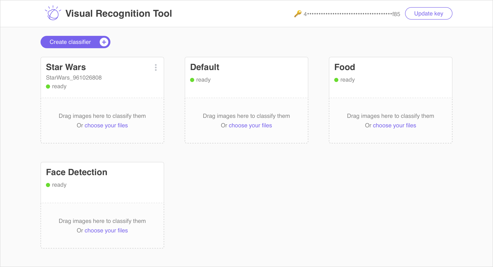

# Watson Visual Recognition Tool
A tool that enables users to create and manage their custom classifiers.

## Web


## iOS


## Using the Endpoint
Use Curl or one of the [Watson SDKS](https://github.com/watson-developer-cloud) to access you trained classifier.
```
curl -X POST \
-F "images_file=@{IMAGE.jpg}" \
"https://gateway-a.watsonplatform.net/visual-recognition/api/v3/classify?version=2016-05-20&threshold=0.0&api_key={API_KEY}&classifier_ids={CLASSIFIER_ID}"
```

You will get a response similar to this.
```
{
   "custom_classes": 2,
   "images": [{
      "classifiers": [{
         "classes": [
            {"class": "Darth Maul", "score": 0.559958},
            {"class": "Darth Vader", "score": 0.047293}
         ],
         "classifier_id": "StarWars_1680254220",
         "name": "Star Wars"
      }],
      "image": "my_test_photo.jpg"
   }],
   "images_processed": 1
}
```
